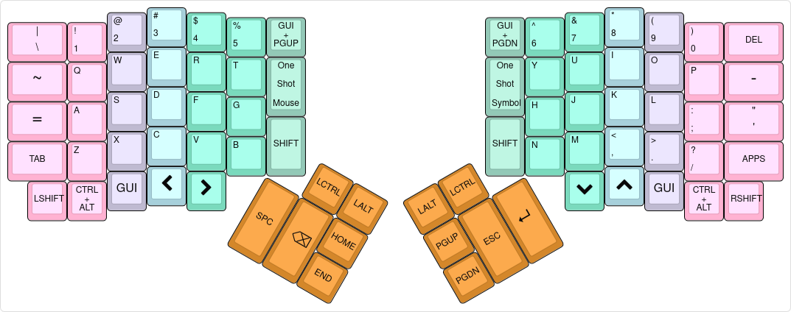
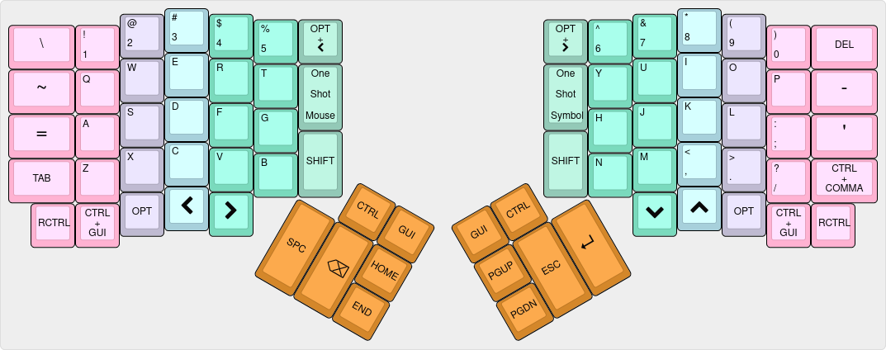
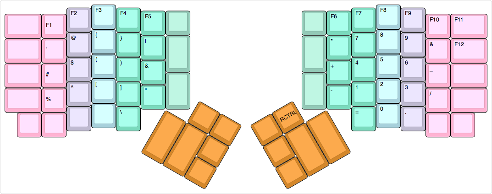
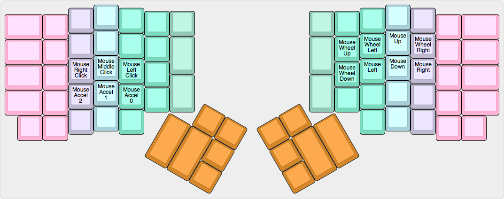

# ergodox-layout
Key layouts for Ergodox keyboard

These are my layouts for the Ergodox keyboard, both for Mac and for Linux.

The layers are both slightly different given the differences in usage of the CTRL and COMMAND keys on both platforms.  However, the essential ergonomic principles are the same.

This is the Linux Base Layer:

This is the Mac Base Layer:

This is the Symbol Layer for both:

This is the Mouse Layer for both:

