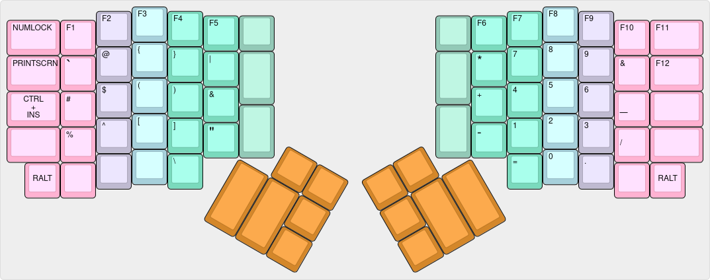
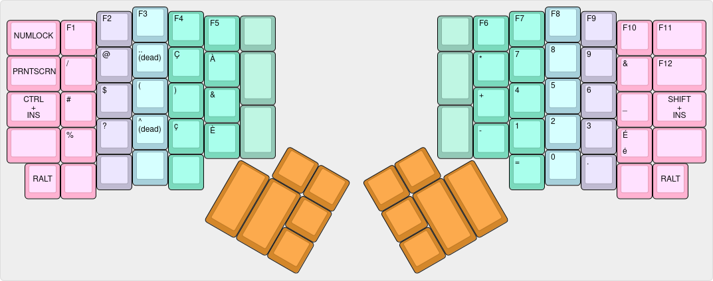

# ergodox-layout
Key layouts for Ergodox keyboard

These are my layouts for the Ergodox keyboard, both for Mac and for Linux.

The layers are both slightly different given the differences in usage of the CTRL and COMMAND keys on both platforms.  However, the essential ergonomic principles are the same.

## Linux and Windows Base Layer:

### US English

### Canadian Multilingual

## Mac Base Layer:

## Symbol Layer for all OS's:

### US English

### Canadian Multilingual

## Mouse Layer for all OS's:

